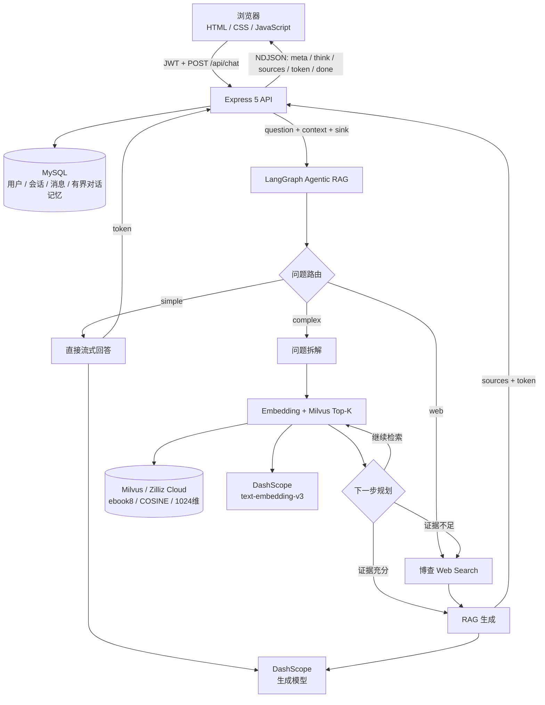

# 基于 LangGraph 与 Milvus 的 Agentic RAG 全栈系统

> 面向《吞噬星空》全集的智能问答应用。系统完成了从 EPUB 解析、文本切片、向量化入库，到问题路由、多跳检索、联网兜底、流式生成、来源展示和会话持久化的完整链路。

[5分钟项目演示](https://b23.tv/blH0lDH)


## 项目概览

这不是一次“检索 Top-K 后直接调用模型”的线性问答。当前 Web 主链路由 LangGraph 编排，会先判断问题类型，再按场景选择直接回答、复杂问题拆解或联网搜索：

- **简单问题**：无需小说证据时直接流式回答；
- **小说事实问题**：拆成可独立检索的子问题，循环执行向量检索与下一步规划；
- **库外资讯问题**：调用博查 Web Search 获取资料后生成答案；
- **本地证据不足**：最近一轮最高相似度低于阈值时自动联网兜底；
- **连续对话**：从 MySQL 读取有限条历史消息用于指代消解，不把完整会话无限塞入上下文；
- **流式交互**：通过 POST + NDJSON 依次推送状态、来源、正文 Token 和完成事件。

### 核心能力

| 能力 | 当前实现 |
|---|---|
| 文档摄入 | EPUB 按章节解析，递归字符切片，生成 1024 维向量 |
| 向量检索 | Milvus `IVF_FLAT` 索引，`COSINE` 相似度，每轮 Top-5 |
| Agent 编排 | LangGraph 条件路由、问题拆解、多跳检索、动态规划 |
| 外部搜索 | 博查 Web Search；缺少密钥或请求失败时可降级 |
| 模型接入 | OpenAI-compatible API，默认面向阿里云百炼 DashScope |
| 流式协议 | POST + `fetch` ReadableStream + NDJSON 事件流 |
| 业务能力 | JWT 鉴权、多用户隔离、多会话、历史消息、来源与思考过程落库 |
| 工程部署 | Docker Compose 编排 Node、MySQL 与 Nginx |
| 基础评测 | 固定 20 题，统计 Top-5 章节命中、关键词正确率与 TTFT |

## 系统架构



### Agentic RAG 状态流

```text
START
  └─ route_question
       ├─ simple  ────────────────> direct_answer ─────────────> END
       ├─ web     ────────────────> web_search ─> rag_generate > END
       └─ complex -> decompose_question
                         └─ retrieve <──> plan_next_step
                               ├─ 本地证据充分 ─> rag_generate > END
                               └─ 低分/需要库外信息 ─> web_search
                                                    └─ rag_generate > END
```

## 技术栈

| 分类 | 技术 | 用途 |
|---|---|---|
| 运行时与后端 | Node.js 20、Express 5、ES Modules | API、静态资源、流式响应 |
| RAG 编排 | LangGraph、LangChain | 状态图、模型封装、文档加载与切片 |
| 结构化输出 | Zod | 路由、问题拆解和规划结果校验 |
| 向量数据库 | Milvus / Zilliz Cloud | 原文向量存储与相似度检索 |
| 生成与向量模型 | DashScope OpenAI-compatible API | 回答生成、文本向量化 |
| 联网搜索 | 博查 Web Search API | 库外资讯与低置信度兜底 |
| 业务数据库 | MySQL 8、mysql2/promise | 用户、会话、消息与思考过程 |
| 鉴权 | JWT、bcrypt | 登录态、密码哈希和接口保护 |
| 前端 | 原生 HTML、CSS、JavaScript、marked.js | 流式渲染、来源展示和会话管理 |
| 部署 | Docker、Docker Compose、Nginx | 容器编排、反向代理与关闭流缓冲 |

## 核心设计

### 1. 数据摄入

`src/main.mjs` 负责构建知识库：

```text
EPUB
  -> 按章节解析
  -> 清洗并跳过过短内容
  -> RecursiveCharacterTextSplitter
       chunkSize = 500
       chunkOverlap = 50
  -> text-embedding-v3（1024维）
  -> Milvus ebook8
       IVF_FLAT + COSINE
```

Embedding 当前采用串行调用，以降低第三方接口 QPS 限制导致的失败概率。`chunkSize`、overlap、Top-K 和索引参数是当前实验配置，并非对所有语料都适用的固定最优值。

### 2. 问题路由与多跳检索

路由模型使用 Zod 约束结构化输出，将问题分为：

- `simple`：寒暄、通用交流等无需检索的问题；
- `complex`：人物关系、情节、因果、章节事实等需要小说证据的问题；
- `web`：作者动态、动画更新、现实资讯等知识库外问题。

复杂问题会被拆成 1～8 个不含模糊指代的独立子问题。系统逐个检索、按文档 ID 去重并保留更高分结果，再由规划节点决定继续检索、联网搜索还是进入生成。Web 接口将单次最大检索轮数设为 5，避免无界循环和成本失控。

### 3. 有界会话记忆

每轮请求在写入当前问题前读取最近 8 条历史消息，并限制单条注入长度。该上下文只用于理解“他”“这个功法”等指代，不作为小说事实依据；事实仍应由 Milvus 检索片段或联网资料支撑。

这个设计避免了两个问题：

1. 完整历史无限增长导致上下文和调用成本失控；
2. 把模型上一轮回答误当成可靠知识来源，放大历史幻觉。

### 4. 本地检索与联网兜底

本地检索使用查询向量在 Milvus 中执行 COSINE 搜索。每轮默认返回 5 个片段，多轮结果按 ID 合并。

当子问题已经处理完、达到检索预算，且最近一轮最高分低于当前经验阈值 `0.55` 时，系统转向 Web Search。该阈值目前是工程经验值，后续应结合验证集上的正负样本分数分布继续校准。

联网搜索失败不会让整条问答链路崩溃：若已有本地资料则继续基于本地证据回答；两类资料都为空时返回明确的无结果提示。

### 5. 流式事件协议

当前实现是 **NDJSON 事件流，不是浏览器 `EventSource` 标准 SSE**。

后端保持 HTTP 响应打开，每个事件写成一行 JSON：

```json
{"type":"meta","conversationId":123}
{"type":"think","text":"正在拆解复杂问题"}
{"type":"sources","sources":[]}
{"type":"token","text":"罗峰"}
{"type":"done","elapsed":5.2}
```

事件顺序为：

```text
meta -> think* -> sources -> token* -> done
```

前端使用 `fetch()`、`ReadableStream`、`TextDecoder` 和换行缓冲逐条解析。选择这种方案是因为问答接口需要 POST 请求体和 Authorization Header；如果改为标准 SSE，则需要使用 `text/event-stream` 和 `data: ...\n\n` 帧格式，或调整连接与鉴权设计。

为避免代理层把整段内容缓冲后一次返回，后端设置 `X-Accel-Buffering: no`，Nginx 同时关闭 `proxy_buffering` 与缓存。

### 6. 并发安全与数据落库

HTTP 层把以下回调组成请求级 `sink`，通过 LangGraph 的 `configurable` 注入图执行：

```js
{
  onThink(text),
  onSources(sources),
  onToken(text)
}
```

图节点不依赖全局变量，因此不同请求的流式事件不会共享同一个输出状态。回答结束后，系统把用户问题、完整回答、来源以及 `{ lines, seconds }` 形式的思考过程保存到 MySQL。

### 7. 鉴权与数据隔离

- 密码使用 bcrypt 哈希，不保存明文；
- JWT 从 `Authorization: Bearer <token>` 读取；
- 用户 ID 只取自服务端验证后的 Token，不信任前端提交值；
- 会话查询与删除同时校验 `conversation_id` 和 `user_id`；
- 数据库查询使用参数化语句；
- 删除会话与关联消息使用同一数据库连接和事务。

## 快速开始

### 前置条件

- Node.js 20+
- pnpm（仓库已包含 `pnpm-lock.yaml`）
- MySQL 8
- Milvus 或 Zilliz Cloud 集群
- 支持 OpenAI-compatible API 的生成与 Embedding 服务
- 可选：博查 Web Search API Key

### 1. 安装依赖

```bash
pnpm install
```

### 2. 配置环境变量

复制 `.env.example` 为 `.env`，并填写真实值。不要提交 `.env`。

```dotenv
# 生成模型与 Embedding
MODEL_NAME=qwen-plus
PLAN_MODEL_NAME=qwen-plus
OPENAI_API_KEY=your_dashscope_api_key
OPENAI_BASE_URL=https://dashscope.aliyuncs.com/compatible-mode/v1
EMBEDDINGS_MODEL_NAME=text-embedding-v3

# Milvus / Zilliz Cloud
MILVUS_ADDRESS=https://your-cluster-address
MILVUS_TOKEN=your_milvus_token

# MySQL；本机端口按实际环境填写
DB_HOST=127.0.0.1
DB_PORT=3307
DB_USER=root
DB_PASSWORD=your_mysql_password
DB_NAME=rag_system

# 鉴权
JWT_SECRET=replace_with_a_long_random_secret
JWT_EXPIRES_IN=2h

# 可选；未配置时无法使用联网搜索
BOCHA_API_KEY=your_bocha_api_key

# 可选
PORT=3000
```

`PLAN_MODEL_NAME` 未配置时复用 `MODEL_NAME`。生产环境必须使用高强度随机 `JWT_SECRET`。

### 3. 初始化 MySQL

建表脚本位于 `deploy/schema.sql`。核心表包括：

- `sys_user`：账号、密码哈希、昵称与角色；
- `conversations`：用户会话；
- `messages`：用户/助手消息、来源 JSON 和思考过程 JSON。

使用 Docker Compose 首次创建空数据卷时，MySQL 会自动执行该脚本；已有数据卷不会重复执行初始化脚本。

### 4. 构建向量知识库

```bash
pnpm ingest
```

该命令会读取仓库根目录中的 EPUB，创建并写入 Milvus 集合。首次运行时间取决于文本规模、Embedding 限流和网络状况；重复执行前请先确认集合处理策略，避免重复数据。

### 5. 启动 Web 应用

```bash
pnpm start
```

浏览器访问：<http://localhost:3000>

### 6. 可选命令

```bash
pnpm query         # 验证向量检索
pnpm rag           # 运行旧版 CLI RAG 示例
pnpm eval:project  # 运行固定 20 题评测，会调用真实模型与向量库
```

`src/query.mjs` 和 `src/rag.mjs` 是独立 CLI 验证脚本；Web 主链路以 `src/server.js` 和 `src/ragGraph.mjs` 为准。

## API 与事件

### 主要接口

| 方法 | 路径 | 鉴权 | 用途 |
|---|---|:---:|---|
| POST | `/api/auth/register` | 否 | 注册 |
| POST | `/api/auth/login` | 否 | 登录并获取 JWT |
| GET | `/api/auth/profile` | 是 | 获取当前用户 |
| POST | `/api/conversations` | 是 | 创建会话 |
| GET | `/api/conversations` | 是 | 获取会话列表 |
| GET | `/api/conversations/:id` | 是 | 获取会话及消息 |
| DELETE | `/api/conversations/:id` | 是 | 删除会话与消息 |
| POST | `/api/chat` | 是 | 执行 Agentic RAG 并返回 NDJSON 流 |

### `/api/chat` 请求示例

```http
POST /api/chat HTTP/1.1
Authorization: Bearer <token>
Content-Type: application/json

{
  "question": "罗峰为什么选择加入极限武馆？",
  "conversationId": 12
}
```

首次提问可以省略 `conversationId`，服务端会自动创建会话并通过 `meta` 事件返回 ID。

## 评测

仓库提供一个轻量级、可重复执行的 20 题评测集：

- **Top-5 检索命中**：直接检索返回的章节中，至少一个命中人工标注章节；
- **回答正确**：回答命中题目配置的最少关键词数；
- **TTFT**：从启动 `runAgenticRAG` 到收到首个 `onToken` 的时间。

最近一次已保存结果（2026-09-19）：

| 指标 | 结果 |
|---|---:|
| 评测问题数 | 20 |
| Top-5 章节命中 | 13/20（65%） |
| 关键词规则正确 | 19/20（95%） |
| 平均首 Token 时间 | 5336 ms |

完整明细见 `eval/results/project-data-table.md`。

> 注意：关键词命中不等同于人工语义正确率，Top-5 章节命中也只评估首次直接检索，不完全覆盖多跳检索对最终答案的贡献。这套评测用于建立可比较的工程基线，不应被解释为严格的学术评测结果。

评测结果暴露出的主要问题是：答案可能借助非标注章节回答正确，但初始 Top-5 对目标章节的召回仍不稳定。后续优先方向是混合检索、扩大初召回后重排，以及更可靠的忠实度/引用一致性评估。

## 项目结构

```text
tsxkRAG/
├─ src/
│  ├─ main.mjs                 # EPUB 摄入、切片、Embedding、Milvus 建库
│  ├─ query.mjs                # 向量检索验证脚本
│  ├─ rag.mjs                  # 旧版线性 RAG CLI 示例
│  ├─ ragGraph.mjs             # Agentic RAG 状态、节点、条件边与对外入口
│  ├─ server.js                # Express 主入口与 /api/chat NDJSON 流
│  ├─ middleware/auth.js       # JWT 鉴权
│  ├─ routes/
│  │  ├─ auth.js               # 注册、登录、个人信息
│  │  └─ chat.js               # 会话 CRUD 与历史消息
│  ├─ models/
│  │  ├─ db.js                 # MySQL 连接池与查询封装
│  │  ├─ userModel.js          # 用户数据访问
│  │  └─ chatModel.js          # 会话、消息、事务与最近对话记忆
│  └─ utils/jwt.js             # JWT 签发与校验
├─ public/
│  ├─ index.html               # 单页应用入口
│  ├─ js/                      # 鉴权、会话、流式协议、来源渲染等模块
│  └─ assets/                  # 图片、视频与音频资源
├─ eval/
│  ├─ questions.json           # 固定 20 题及人工标注
│  ├─ run-project-eval.mjs     # 评测执行与报告生成
│  └─ results/                 # JSON 原始结果与 Markdown 数据表
├─ deploy/
│  ├─ schema.sql               # MySQL 初始化脚本
│  └─ nginx.conf               # Nginx 反向代理与流式配置
├─ Dockerfile
├─ docker-compose.yml
├─ .env.example
└─ package.json
```

## Docker Compose 部署

当前编排包含三个服务：

```text
Browser -> Nginx :80 -> Node/Express :3000 -> MySQL :3306
                              ├────────────> Milvus / Zilliz Cloud
                              └────────────> DashScope / Web Search
```

先构建 Compose 引用的应用镜像，再启动服务：

```bash
docker build -t tsxkrag-app:latest .
docker compose up -d
docker compose ps
docker compose logs -f app
```

当前 `deploy/nginx.conf` 使用项目部署域名并将 HTTP 重定向到 HTTPS。部署到其他环境前，需要将其中的 `server_name` 改为自己的域名，并把 `fullchain.pem`、`private.key` 放入 `deploy/certs/`，然后访问 `https://<你的域名>`。

部署注意事项：

1. Compose 内部连接 MySQL 时使用服务名 `mysql` 和容器端口 `3306`；
2. MySQL 使用命名卷持久化，仍需配置定期备份；
3. 不要对公网暴露 MySQL 端口；
4. Nginx 必须关闭流式接口缓冲；
5. 当前 Compose 只引用 `tsxkrag-app:latest`，不会根据 Dockerfile 自动构建镜像；
6. 生产环境建议配置接口限流、日志脱敏和密钥托管；
7. Milvus、模型和搜索服务位于外部网络，需设置合理的超时、重试与调用预算。

## 已知边界

为准确描述当前完成度，以下能力尚未实现或仍需加强：

- 当前仅使用稠密向量检索，没有 BM25 + 向量混合召回；
- 当前没有独立 reranker，多轮结果仅做 ID 去重和分数择优；
- `0.55` 是经验阈值，尚未通过系统化阈值实验确定；
- 流开始后的异常目前会结束连接，尚未发送显式 `error` 事件；
- 未完整实现客户端断开后的上游模型取消和统一背压控制；
- 请求体校验仍较轻量，后续可加入类型、去空白和长度限制；
- 评测仍以章节命中和关键词规则为主，缺少忠实度、引用一致性及人工盲评；
- 当前没有自动化单元测试与集成测试；
- Embedding 摄入为串行实现，稳定但吞吐量有限。

## 后续计划

- [ ] 混合检索：BM25 + 稠密向量，使用 RRF 融合结果
- [ ] 重排：扩大初召回后使用 reranker 选择最终上下文
- [ ] 评测升级：Recall@K、MRR、答案忠实度、引用一致性和成本统计
- [ ] 流式可靠性：显式 `error` 事件、断线取消、超时与重试
- [ ] 输入安全：严格 Schema 校验、Prompt Injection 防护与内容边界
- [ ] 可观测性：请求 ID、节点耗时、Token 用量、错误率和检索分数分布
- [ ] 数据管道：批量限速、失败重试、断点续传和增量索引
- [ ] 自动化测试：路由节点、检索合并、权限边界与流式协议测试

## 面试讲解提纲

如果用于项目面试，可以按以下顺序在 3～5 分钟内介绍：

1. **问题**：线性 RAG 面对复杂关系问题和库外资讯时能力有限；
2. **方案**：用 LangGraph 将路由、拆解、检索、规划、联网和生成建模为状态图；
3. **检索**：EPUB 切片后写入 Milvus，查询时执行 COSINE Top-K，多轮结果去重；
4. **可靠性**：本地证据不足时联网兜底，无资料时明确拒答；
5. **工程化**：JWT、多用户会话、MySQL 持久化、请求级 sink 和 NDJSON 流；
6. **验证**：用固定 20 题记录检索命中、关键词正确率和首 Token 延迟；
7. **边界**：主动说明尚无混合检索与 reranker，并给出下一步实验方案。

项目最重要的可迁移能力并不是小说领域本身，而是完整的 RAG 数据链路、检索与生成编排、流式接口协议、评测意识以及 Web 工程能力。

## License

本仓库代码按 `package.json` 中声明的 ISC License 使用。小说文本、图片、视频和音频等素材的版权归原作者或原权利人所有，仅用于个人学习与技术演示，请勿用于商业用途。
