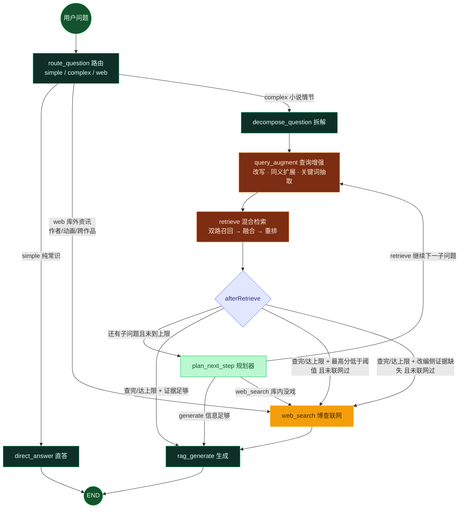
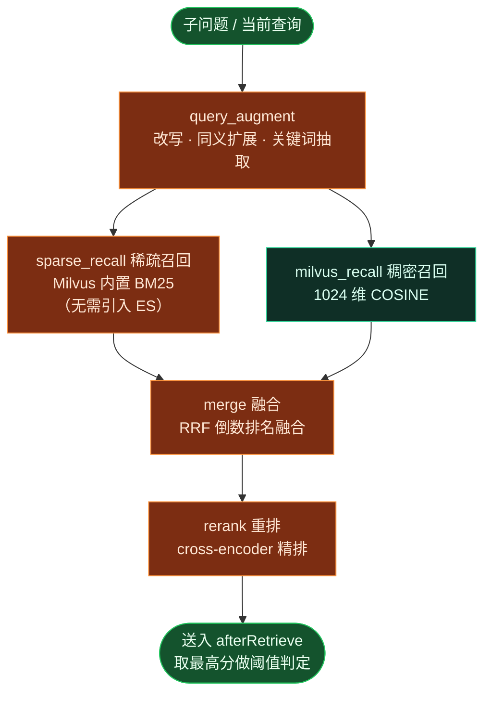
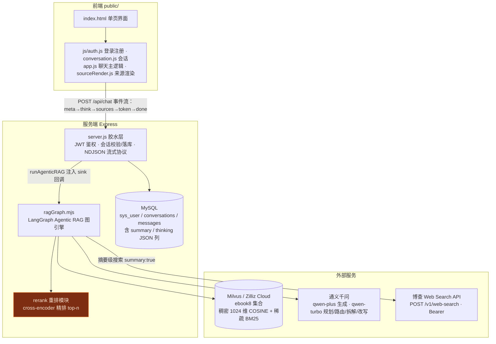

```mermaid
flowchart TD
    Q((用户问题)) --> ROUTE["route_question 路由<br/>simple / complex / web"]

    ROUTE -->|simple 纯常识| DIRECT["direct_answer 直答"]
    ROUTE -->|web 库外资讯<br/>作者/动画/跨作品| WEB["web_search 博查联网"]
    ROUTE -->|complex 小说情节| DECOMP["decompose_question 拆解"]

    DECOMP --> AUG["query_augment 查询增强<br/>改写 · 同义扩展 · 关键词抽取"]
    AUG --> RET["retrieve 混合检索<br/>双路召回 → 融合 → 重排"]
    RET --> AR{afterRetrieve}

    AR -->|还有子问题且未到上限| PLAN["plan_next_step 规划器"]
    PLAN -->|retrieve 继续下一子问题| AUG
    PLAN -->|generate 信息足够| GEN["rag_generate 生成"]
    PLAN -->|web_search 库内没戏| WEB

    AR -->|查完/达上限 + 证据足够| GEN
    AR -->|查完/达上限 + 最高分低于阈值 且未联网过| WEB
    AR -->|查完/达上限 + 改编侧证据缺失 且未联网过| WEB

    WEB --> GEN
    DIRECT --> E((END))
    GEN --> E

    classDef se fill:#14532d,stroke:#22c55e,color:#eafff0
    classDef node fill:#0f2f26,stroke:#34d399,color:#d9fff1
    classDef plan fill:#bbf7d0,stroke:#22c55e,color:#14532d
    classDef webn fill:#f59e0b,stroke:#fbbf24,color:#3b2a00
    classDef dia fill:#e0e7ff,stroke:#818cf8,color:#312e81
    classDef newn fill:#7c2d12,stroke:#fb923c,color:#ffe8d6
    class Q,E se
    class ROUTE,DECOMP,DIRECT,GEN node
    class PLAN plan
    class WEB webn
    class AR dia
    class AUG,RET newn
```

```mermaid
flowchart TB
    IN(["子问题 / 当前查询"]) --> AUG2["query_augment<br/>改写 · 同义扩展 · 关键词抽取"]
    AUG2 --> SP["sparse_recall 稀疏召回<br/>Milvus 内置 BM25<br/>（无需引入 ES）"]
    AUG2 --> MV["milvus_recall 稠密召回<br/>1024 维 COSINE"]

    SP --> MERGE["merge 融合<br/>RRF 倒数排名融合"]
    MV --> MERGE
    MERGE --> RR["rerank 重排<br/>cross-encoder 精排"]
    RR --> OUT(["送入 afterRetrieve<br/>取最高分做阈值判定"])

    classDef newn fill:#7c2d12,stroke:#fb923c,color:#ffe8d6
    classDef keep fill:#0f2f26,stroke:#34d399,color:#d9fff1
    classDef se fill:#14532d,stroke:#22c55e,color:#eafff0
    class AUG2,SP,MERGE,RR newn
    class MV keep
    class IN,OUT se
```

```mermaid
flowchart TB
    subgraph FE["前端 public/"]
        UI["index.html 单页界面"]
        JS["js/auth.js 登录注册 · conversation.js 会话<br/>app.js 聊天主逻辑 · sourceRender.js 来源渲染"]
    end
    subgraph BE["服务端 Express"]
        GW["server.js 胶水层<br/>JWT 鉴权 · 会话校验/落库 · NDJSON 流式协议"]
        GRAPH["ragGraph.mjs<br/>LangGraph Agentic RAG 图引擎"]
        RRK["rerank 重排模块<br/>cross-encoder 精排 top-n"]
        DB[("MySQL<br/>sys_user / conversations / messages<br/>含 summary / thinking JSON 列")]
    end
    subgraph EXT["外部服务"]
        MV[("Milvus / Zilliz Cloud<br/>ebook8 集合<br/>稠密 1024 维 COSINE + 稀疏 BM25")]
        QW["通义千问<br/>qwen-plus 生成 · qwen-turbo 规划/路由/拆解/改写"]
        BC["博查 Web Search API<br/>POST /v1/web-search · Bearer"]
    end
    UI --> JS
    JS -->|"POST /api/chat 事件流：meta→think→sources→token→done"| GW
    GW -->|"runAgenticRAG 注入 sink 回调"| GRAPH
    GW --> DB
    GRAPH --> RRK
    GRAPH --> MV
    GRAPH --> QW
    GRAPH -->|"摘要级搜索 summary:true"| BC

    classDef newn fill:#7c2d12,stroke:#fb923c,color:#ffe8d6
    class RRK newn
```
