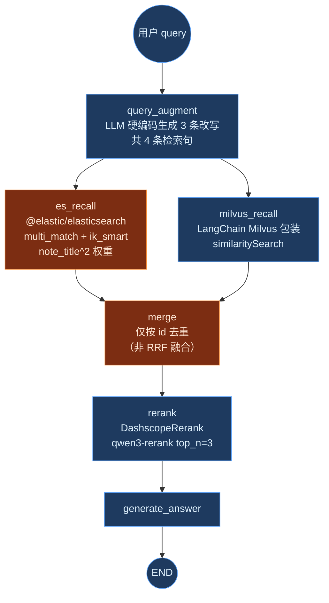
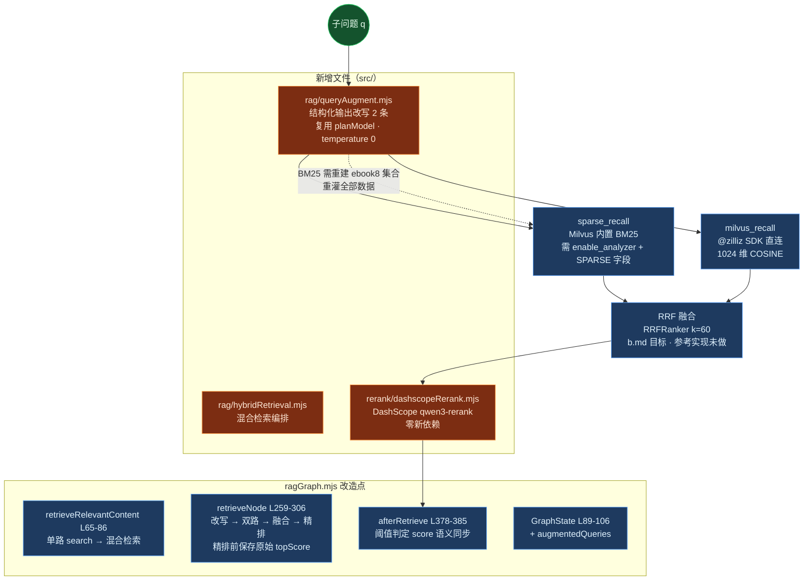
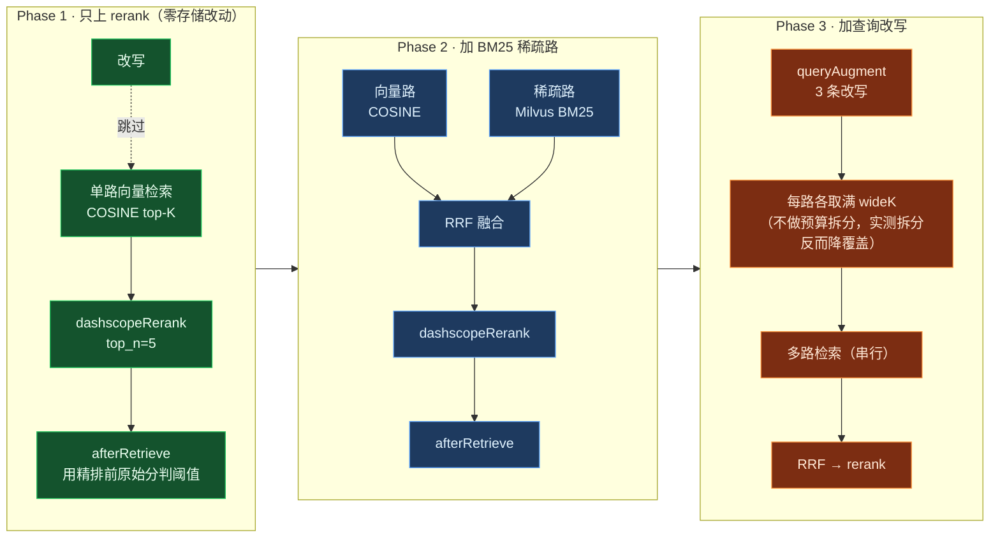
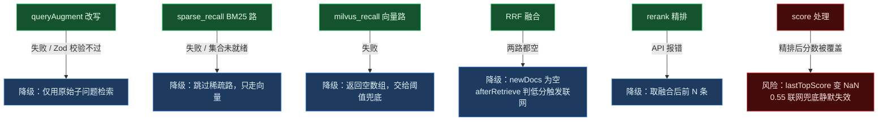

```mermaid
flowchart TD
    Q((用户 query)) --> AUG["query_augment<br/>LLM 硬编码生成 3 条改写<br/>共 4 条检索句"]

    AUG --> ES["es_recall<br/>@elastic/elasticsearch<br/>multi_match + ik_smart<br/>note_title^2 权重"]
    AUG --> MV["milvus_recall<br/>LangChain Milvus 包装<br/>similaritySearch"]

    ES --> MG["merge<br/>仅按 id 去重<br/>（非 RRF 融合）"]
    MV --> MG

    MG --> RR["rerank<br/>DashscopeRerank<br/>qwen3-rerank top_n=3"]
    RR --> GA["generate_answer"]
    GA --> E((END))

    classDef ref fill:#1e3a5f,stroke:#60a5fa,color:#e0f2fe
    classDef warn fill:#7c2d12,stroke:#fb923c,color:#ffe8d6
    classDef drop fill:#450a0a,stroke:#ef4444,color:#fee2e2
    class Q,E ref
    class AUG,MV,RR,GA ref
    class ES,MG warn
```

```mermaid
flowchart TD
    subgraph NEW["新增文件（src/）"]
        AUG2["rag/queryAugment.mjs<br/>结构化输出改写 2 条<br/>复用 planModel · temperature 0"]
        HYB["rag/hybridRetrieval.mjs<br/>混合检索编排"]
        RRK["rerank/dashscopeRerank.mjs<br/>DashScope qwen3-rerank<br/>零新依赖"]
    end

    subgraph CORE["ragGraph.mjs 改造点"]
        RC1["retrieveRelevantContent L65-86<br/>单路 search → 混合检索"]
        RC2["retrieveNode L259-306<br/>改写 → 双路 → 融合 → 精排<br/>精排前保存原始 topScore"]
        RC3["afterRetrieve L378-385<br/>阈值判定 score 语义同步"]
        RC4["GraphState L89-106<br/>+ augmentedQueries"]
    end

    Q((子问题 q)) --> AUG2
    AUG2 --> SP["sparse_recall<br/>Milvus 内置 BM25<br/>需 enable_analyzer + SPARSE 字段"]
    AUG2 --> MV2["milvus_recall<br/>@zilliz SDK 直连<br/>1024 维 COSINE"]

    SP --> RRF["RRF 融合<br/>RRFRanker k=60<br/>b.md 目标 · 参考实现未做"]
    MV2 --> RRF

    RRF --> RRK
    RRK --> RC3

    AUG2 -.->|"BM25 需重建 ebook8 集合<br/>重灌全部数据"| SP

    classDef newn fill:#7c2d12,stroke:#fb923c,color:#ffe8d6
    classDef mod fill:#1e3a5f,stroke:#60a5fa,color:#e0f2fe
    classDef risk fill:#450a0a,stroke:#ef4444,color:#fee2e2
    classDef se fill:#14532d,stroke:#22c55e,color:#eafff0
    class AUG2,HYB,RRK newn
    class RC1,RC2,RC3,RC4,SP,MV2,RRF mod
    class Q se
```

```mermaid
flowchart LR
    subgraph P1["Phase 1 · 只上 rerank（零存储改动）"]
        S1["改写"] -.->|跳过| S2["单路向量检索<br/>COSINE top-K"]
        S2 --> S3["dashscopeRerank<br/>top_n=5"]
        S3 --> S4["afterRetrieve<br/>用精排前原始分判阈值"]
    end

    subgraph P2["Phase 2 · 加 BM25 稀疏路"]
        T1["向量路<br/>COSINE"] --> T3["RRF 融合"]
        T2["稀疏路<br/>Milvus BM25"] --> T3
        T3 --> T4["dashscopeRerank"]
        T4 --> T5["afterRetrieve"]
    end

    subgraph P3["Phase 3 · 加查询改写"]
        U1["queryAugment<br/>3 条改写"] --> U2["每路各取满 wideK<br/>（不做预算拆分，实测拆分反而降覆盖）"]
        U2 --> U3["多路检索（串行）"]
        U3 --> U4["RRF → rerank"]
    end

    P1 --> P2
    P2 --> P3

    classDef p1 fill:#14532d,stroke:#22c55e,color:#eafff0
    classDef p2 fill:#1e3a5f,stroke:#60a5fa,color:#e0f2fe
    classDef p3 fill:#7c2d12,stroke:#fb923c,color:#ffe8d6
    class S1,S2,S3,S4 p1
    class T1,T2,T3,T4,T5 p2
    class U1,U2,U3,U4 p3
```

```mermaid
flowchart TD
    A["queryAugment 改写"] -->|"失败 / Zod 校验不过"| A1["降级：仅用原始子问题检索"]
    B["sparse_recall BM25 路"] -->|"失败 / 集合未就绪"| B1["降级：跳过稀疏路，只走向量"]
    C["milvus_recall 向量路"] -->|"失败"| C1["降级：返回空数组，交给阈值兜底"]
    D["RRF 融合"] -->|"两路都空"| D1["降级：newDocs 为空<br/>afterRetrieve 判低分触发联网"]
    E["rerank 精排"] -->|"API 报错"| E1["降级：取融合后前 N 条"]
    F["score 处理"] -->|"精排后分数被覆盖"| F1["风险：lastTopScore 变 NaN<br/>0.55 联网兜底静默失效"]

    classDef ok fill:#14532d,stroke:#22c55e,color:#eafff0
    classDef fall fill:#1e3a5f,stroke:#60a5fa,color:#e0f2fe
    classDef bad fill:#450a0a,stroke:#ef4444,color:#fee2e2
    class A,B,C,D,E ok
    class A1,B1,C1,D1,E1 fall
    class F,F1 bad
```