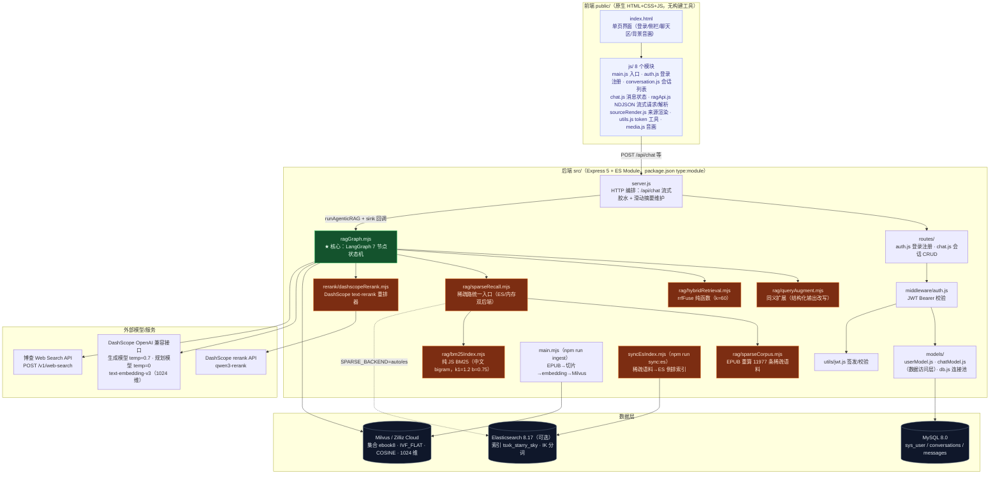
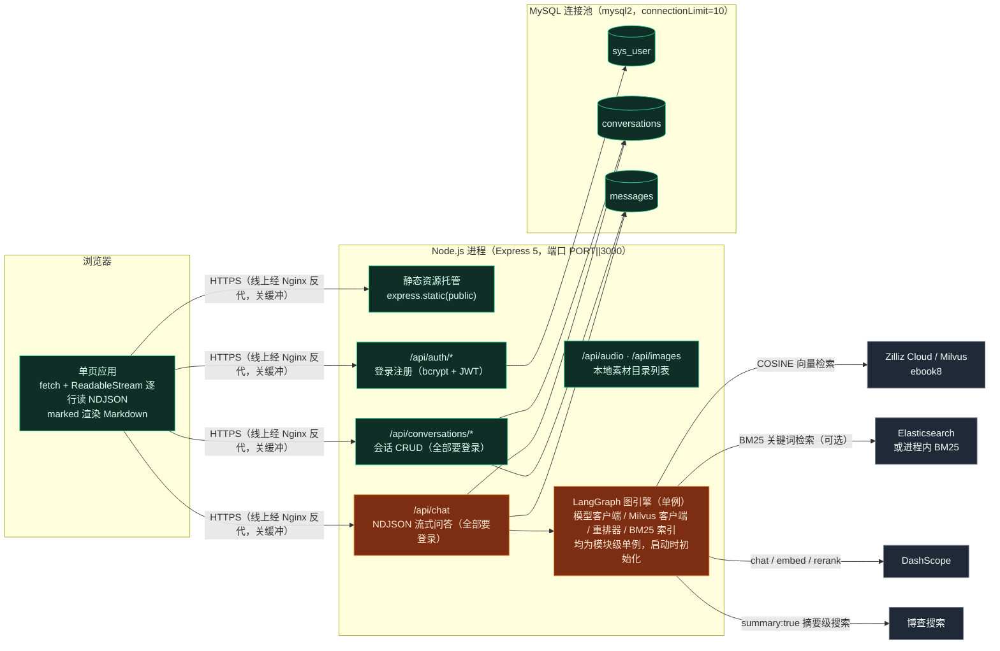
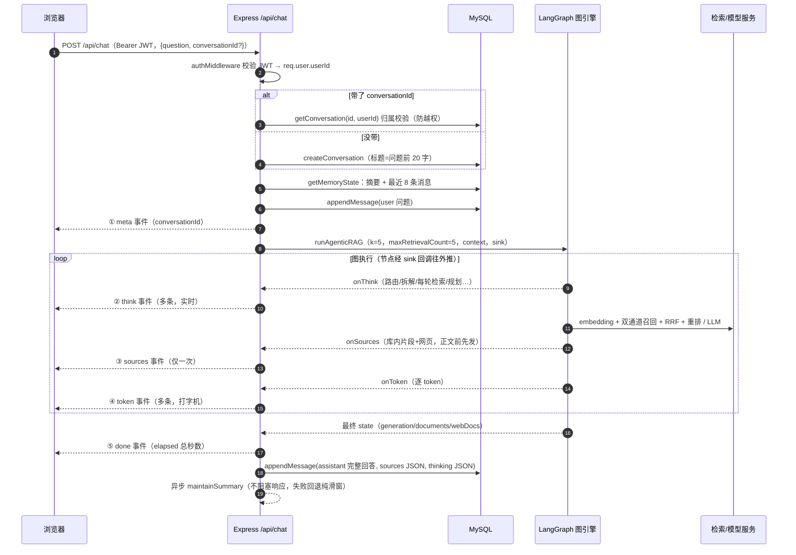
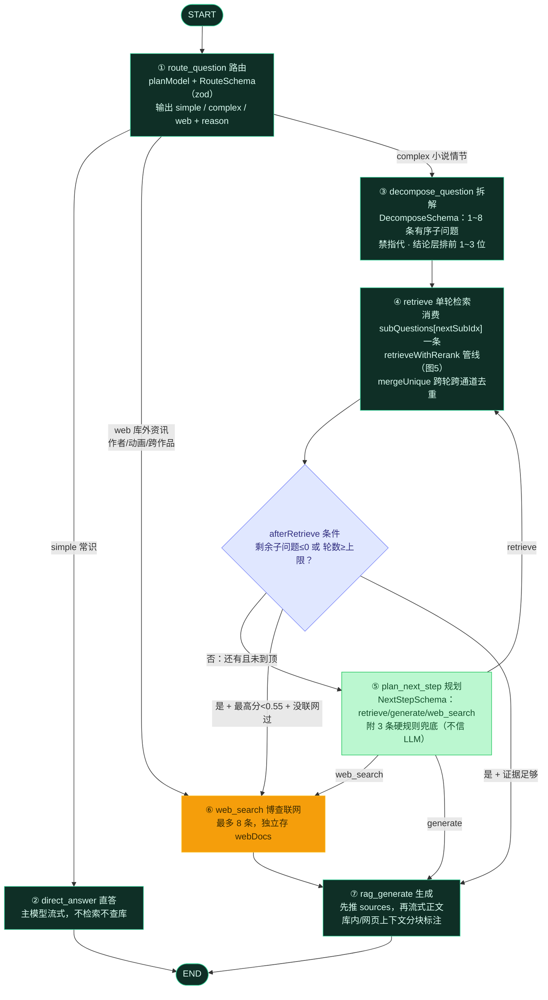
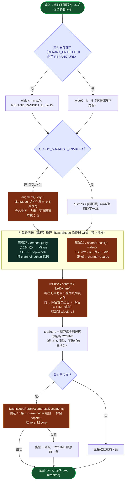
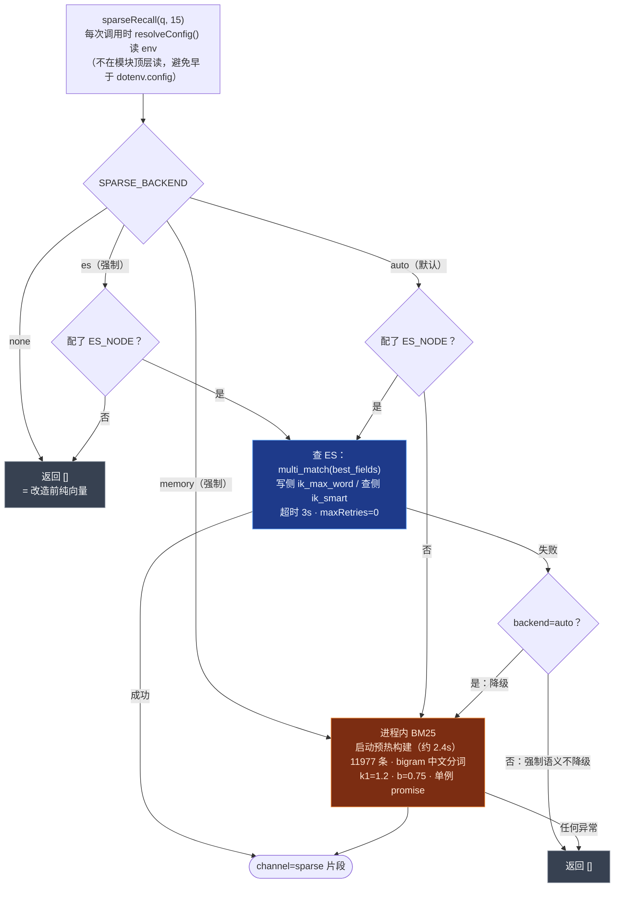
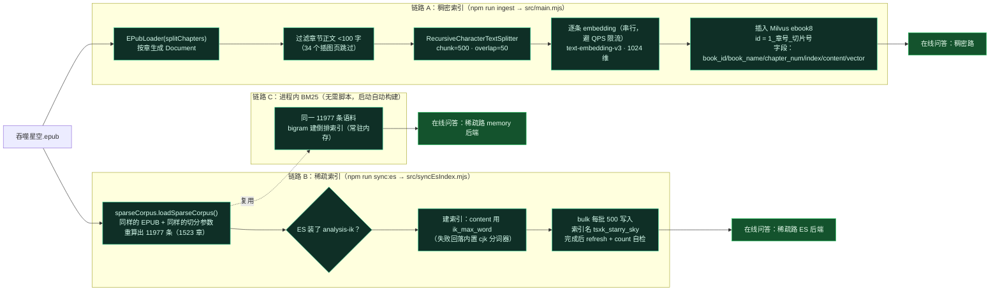
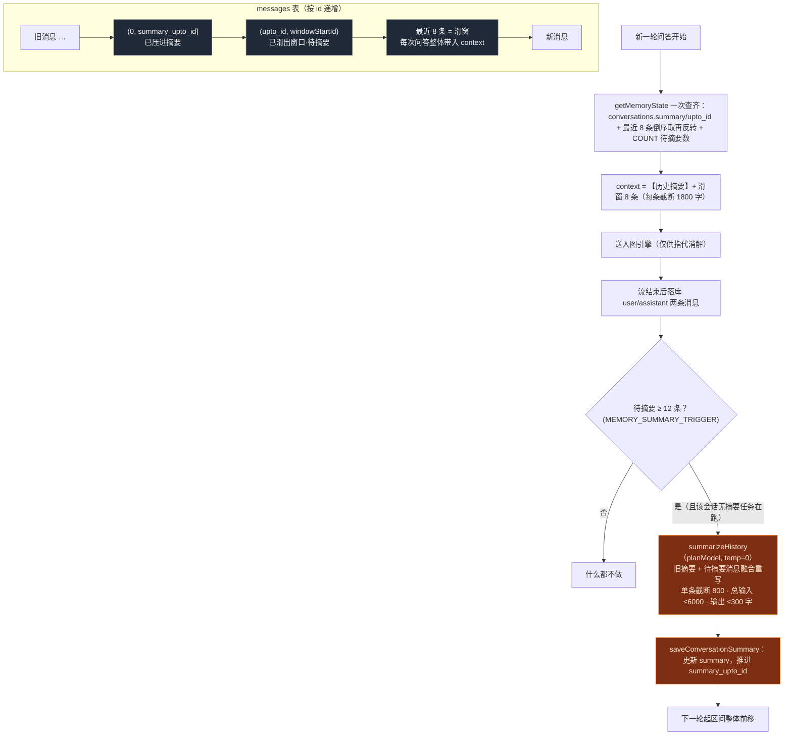
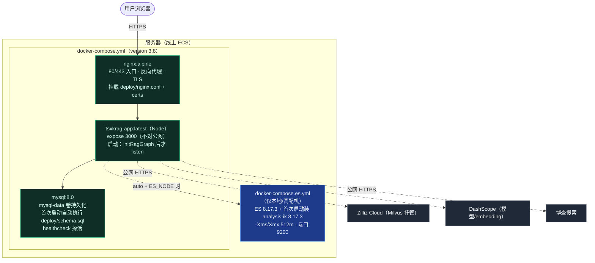

# 吞噬星空 RAG 助手 · 项目全景逻辑链（d.md）

> 本文用 **9 张图 + 逐图详解**，按「先看骨架、再串流程、最后看数据与部署」的顺序，
> 把项目从一次请求到一次部署的完整逻辑链画清楚。所有节点名、参数、阈值、文件路径均与源码一致。
>
> 阅读顺序：图1 项目地图 → 图2 总体架构 → 图3 一次问答时序 → 图4 状态机 → 图5 检索管线
> → 图6 稀疏后端选择 → 图7 数据摄入 → 图8 记忆与落库 → 图9 部署拓扑。

---

## 图 1 · 项目地图：代码分层与职责

**怎么读这张图**

- **绿色节点 [ragGraph.mjs](src/ragGraph.mjs)** 是系统心脏：HTTP 层不做任何 RAG 逻辑，只把请求交给它、把它的回调转成 HTTP 流。
- **橙色节点是混合检索改造新增的 7 个文件**：同义扩展、RRF 融合、稀疏召回、EPUB 语料重算、纯 JS BM25、DashScope 重排器、ES 灌库脚本。
- **两条数据写入链与在线问答链完全分离**：[main.mjs](src/main.mjs) 灌 Milvus、[syncEsIndex.mjs](src/syncEsIndex.mjs) 灌 ES，都是离线一次性脚本，不参与线上请求。
- 后端分层是标准的 **route → middleware → model**：[routes/](src/routes/) 只映射 URL，[models/chatModel.js](src/models/chatModel.js) 只写 SQL（全部 `?` 参数化），业务编排在 [server.js](src/server.js) 和 ragGraph。
- 前端 8 个 JS 模块全是原生 ES Module，`public/` 整个目录由 `express.static` 直接托管。

---

## 图 2 · 总体架构：运行时拓扑

**关键点**

1. **图引擎是模块级单例**：模型客户端、Milvus 客户端、重排器、进程内 BM25 索引在进程启动时初始化一次（`initRagGraph()`：连 Milvus + loadCollection + `warmupSparseBackend()`），请求间复用。
2. **问答接口只有一个热点 `/api/chat`**，其余都是普通 JSON 接口。它与普通接口的区别是响应体不是 JSON，而是 **NDJSON 事件流**（图 3 详解）。
3. **四个外部依赖，三个可降级**：Milvus 是唯一硬依赖；DashScope 重排未配置时退化为 COSINE 排序；ES 不可用时稀疏路退化为进程内 BM25；博查 Key 缺失时跳过联网。
4. **Nginx 在线上只做一件与本系统强相关的事**：反向代理 + 关闭响应缓冲（后端也主动发 `X-Accel-Buffering: no`），否则打字机效果会被攒成一大段。

---

## 图 3 · 一次问答的端到端时序（最核心的一条链）

**逐段拆解**

- **第 1~4 步（准入与归属）**：JWT 解析失败返回 401（区分过期/非法两种文案）；会话 id 必须与 userId 同时匹配，查不到直接 403——水平越权防护。
- **第 5 步（拼记忆）**：`conversationContext = 【历史摘要】… + 最近 8 条消息`，两者靠 `summary_upto_id` 无缝衔接（图 8 详解）。
- **第 7 步起（流）**：响应头 `Content-Type: text/plain` + `X-Accel-Buffering: no`，`send()` 每写一个对象就换行。**事件顺序是协议契约**：`meta → think* → sources → token* → done`。前端 [ragApi.js](public/js/ragApi.js) 用 `TextDecoder(stream:true)` + 按 `\n` 切包，专门处理中文字符被 TCP 包切断的问题，坏行直接跳过、断网保留半截正文。
- **sink 注入方式**：回调集合通过 `graph.invoke(input, { configurable: { sink } })` 传入，不走全局变量——并发请求各自持有各自的 `res`，天然隔离。
- **落库在流结束之后**：先把整段回答吐给用户，再写 assistant 消息（含 sources、thinking 两个 JSON 列），用户不等数据库。
- **生产参数**：`k=5`、`maxRetrievalCount=5`（[server.js 第 154-155 行](src/server.js#L154-L155)）；注意评测脚本 [run-project-eval.mjs](eval/run-project-eval.mjs) 用的是 3，对比数据时不要混。

---

## 图 4 · LangGraph 状态机全景（7 节点 + 条件边）

**护栏与设计点（面试高频）**

1. **三条路径一次路由定终身**：simple 直答最省；web 跳过整个检索；complex 才进多跳循环。路由 prompt 里明确喂入对话上下文，但标注「仅用于理解指代，不可作为小说事实依据」。
2. **拆解的两条 prompt 铁律**：① 禁止「他/她/此人」等指代——每条子问题要独立去 embedding，指代必须在此消解；② 结论层优先（前 1~3 位）——因为检索轮数有硬顶，排后面的子问题可能轮不到。
3. **afterRetrieve 先于规划器做硬分流**：子问题查完或轮数到顶时，**直接**分流 generate/web_search，跳过一次规划 LLM 调用（省 3~6 秒）；只有「还能继续查」时才花钱问规划器。
4. **低分联网阈值 0.55**：`lastTopScore` 只取稠密路 COSINE 最高分（库内正常命中 0.63~0.77，库外主题实测 0.4~0.55）。BM25 分和 rerank 分被严格排除在外，否则阈值静默失效。
5. **规划器输出不信任**：即使 LLM 说 web_search，若已联网过则强制改 generate；说 retrieve 但没有剩余子问题/轮数到顶也强制 generate。
6. **三重循环保护，图必收敛**：检索轮数硬顶（生产 5 / 评测 3）＞ 子问题数量 ≤8 ＞ `webSearched` 单次联网闸门。最坏路径 = 5 次检索 + 1 次联网。
7. **生成节点的两个兜底**：库内网页双空 → 固定话术「抱歉，没有在《吞噬星空》中找到相关内容。」；sources 事件保证在正文之前发出，极端情况由 server.js 用最终 state 补发。

---

## 图 5 · 单轮检索管线（retrieveWithRerank 内部全貌）

**关键决策与原因**

- **宽召回只在有重排时打开**：没有重排器却取 15 条，多出的 10 条没人用，纯浪费。
- **每条问句 × 每条通道各取满 wideK，不做预算拆分**：参考实现的 `kEach=ceil(K/n)` 会在「同通道同义问句结果高度重叠」时把候选稀释（实测 12 → 6），故弃用。
- **RRF 只认名次不认分**：天然解决「COSINE ∈ [0,1] 与 BM25 无上界（实测 33.24）不可比」的问题，k=60。
- **稠密路排在稀疏路之前是语义而非风格**：rrfFuse 对同 id 保留首个对象，排前面才能保证跨通道重复命中的片段带着 COSINE 分流出，后续 0.55 阈值和前端分数显示才成立。
- **三层降级全部静默**：扩展失败 → 单路；稀疏失败 → 空数组（纯向量）；重排失败 → COSINE 前 k。任何一层挂掉，问答链路不断。
- **消费端去重 [mergeUnique](src/ragGraph.mjs#L339-L361)**：跨轮检索同 id 去重；跨通道同 id 一律留稠密那条；同通道留高分。避免重复片段浪费 prompt、诱导 LLM 重复作答。

---

## 图 6 · 稀疏路后端选择与降级决策（SPARSE_BACKEND）

**为什么是这套设计**

- **线上 ECS 只有 1.6GiB 内存且 `vm.max_map_count=65530`（ES8 要求 ≥262144），跑不起 ES** → 默认 `auto` 且不注入 `ES_NODE` 时自动落进程内 BM25；本地开发用 `docker-compose.es.yml` 起 ES 8.17 + analysis-ik。
- **语料不查 Milvus 而从 EPUB 重算**（[sparseCorpus.mjs](src/rag/sparseCorpus.mjs)）：Milvus 分页取数受 gRPC 4MB 限制只能取回 10970 个唯一 id，比实际 11977 条丢约 1007 条；直接按与灌库相同的参数（CHUNK_SIZE=500 / OVERLAP=50 / 章节 <100 字跳过 / id=`1_章号_切片号`）重算，保证与 Milvus 的 id 体系对齐。
- **ES 客户端 `maxRetries=0`**：ES 挂了要 3 秒内快速失败走降级，不能把问答拖住。
- **纯 JS bigram 分词**：连续中文切滑动二元组、ASCII 切整词小写；不引 jieba（node-gyp 原生编译在 Windows/服务器上都是风险）。

---

## 图 7 · 数据摄入：两条离线链路

**核对过的数字**

- Milvus 侧：集合 `ebook8`，索引 IVF_FLAT（nlist=1024）+ COSINE；Milvus `count(*)` 为 12062（历史灌库批次差异）。
- 稀疏侧：EPUB 重算 **11977 切片 / 1523 章 / 跳过 34 插图页**；`npm run sync:es` 写入 11977 条、索引实查 11977；进程内 BM25 top 分实测 33.24。
- 两条链路的切分参数和 id 规则刻意保持一致——RRF 融合时稠密/稀疏命中的同一段文字必须是同一个 id，融合才有意义。

---

## 图 8 · 对话记忆与落库：滑窗 + 滑动摘要

**设计意图**

- **滑窗保「最近细节」精确，摘要保「远期脉络」不丢**：三段区间靠 `summary_upto_id` 严格不重叠，不会重复压缩同一批消息。
- **摘要是异步旁路**：`maintainSummary` 在响应结束后才触发，用进程内 Set 防止同会话并发重复压缩；失败只记日志，记忆自动回退为纯滑窗，问答无感。
- **落库三列**：messages.content 存全文，sources 存检索来源 JSON（chapter/score/content，网页还带 url/siteName/siteIcon/dateLastCrawled），thinking 存 `{lines:[...], seconds}`——历史会话回放时思考面板可完整复现。

---

## 图 9 · 部署拓扑（docker-compose）

**部署相关事实（均来自仓库文件）**

- 编排里 **app 依赖 mysql 健康检查通过才启动**；镜像本地构建后 `docker save → scp → docker load` 上线（服务器拉镜像不稳定）。
- **当前 docker-compose.yml 的 app 环境变量清单里没有注入 `RERANK_*` / `SPARSE_*` / `ES_NODE`**：容器内将按代码默认值运行——重排因无 `RERANK_URL` 自动关闭（启动告警），稀疏路为 `auto` 且无 ES 地址 → 走进程内 BM25（常驻约 177MB 堆）。若 ECS 内存吃紧需在 compose 显式加 `SPARSE_BACKEND=none`；要在容器里开重排，则需补 `RERANK_URL`、`RERANK_MODEL`。
- 环境变量分两类：`.env` 本地开发用（不入库，.gitignore 已忽略）；容器环境由 compose 的 `environment:` 显式枚举。
- 端口统一 `process.env.PORT || 3000`，适配平台分配。

---

## 附 · 一张表记住全系统的「数字契约」

| 位置 | 参数 | 值 | 出处 |
|---|---|---|---|
| 检索 | 每轮最终条数 k | 5 | server.js |
| 检索 | 检索轮数上限 | 生产 5 / 评测 3 / 图默认 3 | server.js · eval · ragGraph |
| 检索 | 子问题数量 | 1~8 | DecomposeSchema |
| 检索 | 宽召回候选 RERANK_CANDIDATE_K | 15 | .env / 默认值 |
| 融合 | RRF k | 60 | hybridRetrieval.mjs |
| 阈值 | 低分联网 lastTopScore | < 0.55 | ragGraph 常量 |
| 重排 | 保留 topN | 跟随 k=5 | ragGraph |
| 稀疏 | BM25 参数 | k1=1.2，b=0.75 | bm25Index.mjs |
| 稀疏 | ES 超时 / 批量 | 3000ms / 500 条 | sparseRecall / syncEsIndex |
| 切分 | chunk / overlap / 最小章节 | 500 / 50 / 100 字 | main.mjs · sparseCorpus.mjs |
| 向量 | 维度 / 度量 / 索引 | 1024 / COSINE / IVF_FLAT nlist=1024 | main.mjs |
| 语料 | 切片数 / 章节数 | 11977 / 1523 | 实测（docs/04） |
| 记忆 | 滑窗 / 摘要触发 / 摘要上限 | 8 条 / 12 条待摘要 / 300 字 | chatModel · ragGraph |
| 鉴权 | 密码哈希 / token 有效期 | bcrypt cost=10 / 2h | auth 路由 · jwt.js |
| 联网 | 每次问答最多次数 / 每轮条数 | 1 次 / 8 条 | webSearched 闸门 · webSearchNode |
| 流式 | 事件顺序 | meta→think*→sources→token*→done | server.js · ragApi.js |
