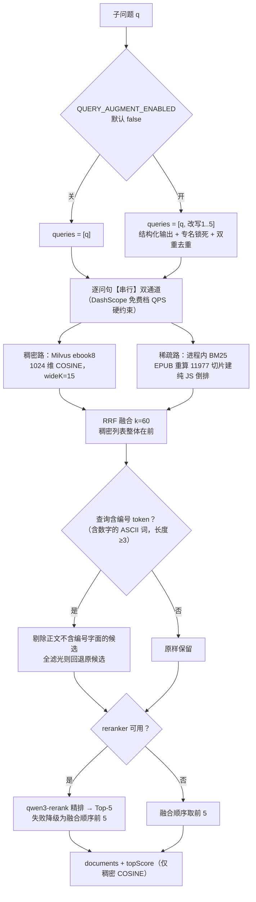

# 05 · 混合检索精简重构与编号硬过滤（当前生效版本）

> 本文记录在 01~04 文档落地后，按「最小文件数、最小改动」对检索层做的一轮**精简重构**。
> **当本文与 01~04 的描述冲突时，以本文为准**：01~04 描述的是含 ES、含 src/rag 五文件的阶段版本；
> 当前线上代码已删除 ES 链路、合并文件，并新增编号硬过滤。
>
> 落地日期：2026-09-28　涉及模块：[`src/hybrid.mjs`](../src/hybrid.mjs)、[`src/ragGraph.mjs`](../src/ragGraph.mjs)、[`src/rerank/dashscopeRerank.mjs`](../src/rerank/dashscopeRerank.mjs)

---

## 一、本阶段做了什么（一句话）

把检索层从 **6 个文件 + Elasticsearch 依赖** 收敛为 **2 个文件、零外部检索服务**，
最终链路为：

```
子问题
  →（可选，默认关）planModel 查询扩展：1 条原问题 + 最多 5 条改写问句
  → 每条问句【串行】双通道召回：Milvus 稠密 COSINE ＋ 进程内 bigram BM25
  → RRF 倒数排名融合（按 id 去重，稠密路在前保 COSINE 分）
  → 编号/型号/规范代号字面硬过滤（条件触发，可回退）
  → DashScope qwen3-rerank 精排 15 → 5（失败自动降级）
  → 进 LangGraph 多跳累积（mergeUnique 跨轮去重）
```



---

## 二、技术选型决策（含放弃了什么、为什么）

### 决策 1：删除 Elasticsearch，稀疏路改为进程内纯 JS BM25

| 维度 | ES 8.17（01~04 阶段） | 进程内 BM25（当前） |
|---|---|---|
| 依赖 | `@elastic/elasticsearch` 包 + Docker 容器 + JVM + analysis-ik 插件 | **零新依赖**，Node 原生 Map |
| 线上可行性 | ECS 仅 1.6GiB 内存、可用 ~479MiB，`vm.max_map_count` 不满足 ES8 要求 | 11977 条约占 **177MB 堆 / 438MB RSS** |
| 打分 | Lucene BM25（IK 分词） | **同一 BM25 公式**，k1=1.2、b=0.75（Lucene 默认参数） |
| 分词 | IK 词典 | 中文 bigram 滑动二元组（零词典） |
| 冷启动 | 索引持久化 | 启动时从 EPUB 重算建索引，实测 **1.1~2.4s**，放在 `initRagGraph` 预热 |
| 查询 | HTTP 往返 | 进程内查表，毫秒级、零 API、零网络 |

**判断依据**：数据规模仅 11977 个 500 字切片，远没到需要独立检索服务的量级；
ES 是本项目最重的运维依赖，而它内部做的「分词 + 倒排表 + BM25」三件事用约 200 行 JS 即可等价实现。

**承认的边界**：① 没有专业词典，强术语密度的规范/医疗库上 IK+自定义词典更强；
② 规模上界受进程内存限制，百万级片段需回到 ES 或外置检索服务；
③ 多实例部署时每个进程各建一份索引（当前单实例无影响）。

### 决策 2：6 个文件合并为 2 个

| 删除/合并 | 去向 |
|---|---|
| `src/rag/sparseCorpus.mjs`（EPUB 重算） | 合入 `src/hybrid.mjs` 第①节 |
| `src/rag/bm25Index.mjs`（分词/索引/检索） | 合入 `src/hybrid.mjs` 第②③④节 |
| `src/rag/sparseRecall.mjs`（ES/内存双后端） | 合入 `src/hybrid.mjs`，**只保留内存后端** |
| `src/rag/hybridRetrieval.mjs`（rrfFuse） | 合入 `src/hybrid.mjs` 第⑥节 |
| `src/rag/queryAugment.mjs` | 精简期删除，后按需求加回，**内联进 `ragGraph.mjs`**（见决策 4） |
| `src/syncEsIndex.mjs`、`docker-compose.es.yml` | **删除**；package.json 移除 `sync:es` 脚本与 `@elastic/elasticsearch` 依赖 |

最终文件：

- [`src/hybrid.mjs`](../src/hybrid.mjs)：语料重算 → 分词 → BM25 → 稀疏召回 → 编号过滤 → RRF，单文件约 300 行
- [`src/rerank/dashscopeRerank.mjs`](../src/rerank/dashscopeRerank.mjs)：DashScope 原生 text-rerank 协议客户端，原样保留

### 决策 3：分词用 bigram，不引 jieba

- Node 生态主流 jieba 是 node-gyp 原生模块，Windows 编译与服务器部署都有风险；bigram 零依赖。
- 实测 IK 会把人名「罗峰」切成 `罗|峰`（拆成单字），bigram 反而保留「罗峰」整词，小说人名命中率更高。
- 规则（[`tokenize()`](../src/hybrid.mjs)）：连续 CJK 切滑动二元组（长度 1 保留单字）；连续 ASCII/数字切整词并小写；标点空白作分隔符。
- 副作用：无词典切分对多字术语会拆碎（如「高血糖」→`高血|血糖`），靠 BM25 的 IDF 累加区分，医疗/规范库若精度不足应上词典方案。

### 决策 4：查询扩展先删后加——加回但默认关、不新增文件

精简期曾整体删除查询扩展；本阶段评估后加回，形态调整为：

- **内联在 `ragGraph.mjs`**：它与路由/拆解/规划同属 planModel 的结构化输出任务，不值得单开文件；
- **默认关闭**（`QUERY_AUGMENT_ENABLED=false`）：每轮多 1 次小模型 + 每条改写多两路召回，免费档 QPS 下代价明确；
- 保留之前验证过的全部设计：zod 范围约束 `min(1).max(5)`（不写死 3、不用原问题补齐）、
  原问题固定第 0 位、与原问题/彼此双重去重、**专名与型号必须原样保留**的 prompt 硬规则、失败静默降级。

### 决策 5：编号/产品名/规范代号「交给 BM25」——用结果过滤，不用查询分流

需求是查 `GB/T 19001`、`iPhone15`、`Q235` 这类编号时，不要让向量路的语义泛论混进答案。
调研参考实现后确认：**advanced-rag 里并不存在编号分流器**（ES/Milvus 无条件并行，改写 prompt 仅有「型号原样保留」一句）。

最终方案是 RRF 融合后的一道后置闸门（约 12 行），而非新增分类节点：

1. `extractIdentifiers()`：对查询分词，提取「纯 ASCII、含数字、长度 ≥3」的 token（如 `19001`、`iphone15`、`q235`）；
2. `filterByIdentifier()`：候选正文分词后必须命中至少一个编号 token，否则剔除；
3. 全滤光（如编号写错）→ **回退原候选**，交由 0.55 低分阈值走联网兜底；
4. 用**原问题**判定，不受改写措辞影响。

**为什么不用显式分流（识别为编号查询就跳过稠密路）**：

- 省一个 LLM 分类节点（延迟 + 误判点），混合句「iPhone15 续航怎么样」无需二分类；
- 稀疏路是进程内毫秒级调用，双路并行不浪费钱，没有「跑错路」成本；
- 中文产品名（二甲双胍）刻意不纳入——bigram 组合太宽，硬过滤误杀率不可接受，交给 IDF 与重排裁决。

### 决策 6：保留不动的四条既有硬约束

1. **串行召回**：多路问句一律 `for...await`，禁止 `Promise.all`（DashScope 免费档 QPS，并发批量 429）；
2. **不做预算拆分**：每条问句每通道取满 wideK（参考实现 `kEach=ceil(K/n)` 实测会把重叠候选从 12 稀释到 6）；
3. **稠密路列表整体排在稀疏路之前**进 RRF：同 id 首次出现的对象被保留，确保 COSINE 分不被无上界 BM25 分（实测可达 33.24）顶掉；
4. **topScore 只取稠密路 COSINE**：0.55 联网阈值与前端分数显示的唯一尺子，BM25 分在来源卡片显示为 `-`。

---

## 三、环境变量（当前全集）

| 变量 | 默认 | 作用 | 回退含义 |
|---|---|---|---|
| `RERANK_ENABLED` | `true` | 重排总开关 | `false` 关闭重排 |
| `RERANK_CANDIDATE_K` | `15` | 宽召回条数（融合后送重排条数） | 设 `5` = 不宽召 |
| `RERANK_TOP_N` | 跟随 k=5 | 重排保留条数 | — |
| `RERANK_URL` / `RERANK_MODEL` | 无 / `qwen3-rerank` | DashScope 原生 rerank 端点 | 未配 URL 自动停用重排 |
| `QUERY_AUGMENT_ENABLED` | `false` | 查询扩展开关 | `false` = 只检索原问句 |
| `AUGMENT_QUERY_COUNT` | `3` | 改写条数（不含原问题，1~5，超 5 按 5） | — |
| `SPARSE_BACKEND` | `memory` | 仅 `memory` / `none` 两值 | `none` = 关闭稀疏路（= 纯向量基线） |
| `EPUB_FILE` | 项目根的吞噬星空 EPUB | 稀疏语料来源 | — |

> 已移除的变量：`ES_NODE`、`ES_INDEX`、`ES_RECREATE`、`ES_BULK_BATCH`、`ES_REQUEST_TIMEOUT`、
> `ES_ANALYZER`、`ES_SEARCH_ANALYZER`、`SPARSE_QUERY_MODE`（auto/es 后端一并取消）。

一键回到改造前基线：`RERANK_ENABLED=false` + `RERANK_CANDIDATE_K=5` + `SPARSE_BACKEND=none` +
`QUERY_AUGMENT_ENABLED=false`（默认即是）。

---

## 四、三层降级链（增强永不阻断问答）

| 故障点 | 降级行为 |
|---|---|
| 查询改写失败/校验不过 | 静默退化为 `queries=[原问题]` |
| 稀疏语料重算或 BM25 检索异常 | 该轮稀疏路返回 `[]`，RRF 只剩稠密路 |
| 编号过滤后候选为空 | 回退过滤前完整候选 |
| Rerank API 报错 | 取 RRF 融合顺序前 K 条，标记 `reranked:false` |
| 库内整体低分（topScore<0.55） | afterRetrieve 转博查联网兜底（每问最多一次） |

---

## 五、验证记录（2026-09-27/28 本机实测）

**构建与纯函数**：

- 稀疏语料：**11977 条切片 / 1523 章 / 跳过 34 个插图页**，重算 1.1~1.2s，BM25 索引构建 1.1~1.3s；
- bigram 断言：`摩云藤对罗峰 → 摩云|云藤|藤对|对罗|罗峰`；
- RRF 断言：两路都出现的 id 排名第一且保留首个对象；
- 编号过滤断言：`GB/T 19001` 提取 `[19001]`、`iPhone15→[iphone15]`、`Q235→[q235]`；
  纯中文与「第3章」不触发；含编号泛论被剔除、全滤光回退、普通查询原样返回。

**端到端（同一题「罗峰成为武者时为什么选择加入极限武馆」）**：

| 配置 | 现象 | 结果 |
|---|---|---|
| 扩展关（默认） | 无改写日志 | 候选 15 → 5，topScore 0.7722，最高 rerank 0.9814 |
| 扩展开 | 生成 3 条改写，专名原样保留 | 候选 15 → 5，topScore **0.7832**，最高 rerank 0.9814 |
| 稀疏路关键词 | 「摩云藤对罗峰有什么价值」 | 首条 `1_719_6`（719 章），BM25 21.92，channel=sparse |
| `SPARSE_BACKEND=none` | 稀疏路 | 返回 0 条 |

**历史 A/B 数据（引用口径，务必注意）**：

01~04 阶段的消融实验（20 题金标）结论为：检索层 Top-1 命中 5→6（只加重排）→8（全开），
金标章节覆盖 16→14→19；答案层全链路正确回答 18/20→20/20，平均每题 +1.2s。

⚠️ 该数据产生于 **ES 后端 + 查询扩展开启** 的阶段版本。当前代码的核心管线（宽召回/双通道/RRF/重排）
一致、量级结论成立，但稀疏后端已换为同公式进程内实现、扩展默认关闭。
若需与当前代码逐字对应的数字，重跑 `npm run eval:ab` 与 `npm run eval:ab:answer`。

---

## 六、踩坑实录：查询扩展让单题思考时间翻倍（2026-09-28 实测）

### 现象

同一道复杂题（「巨斧创始者、巨斧、金角巨兽、金角族群四者关系」，均跑满 5 轮检索），
前端「已完成思考」计时：

| 配置 | 思考耗时 | 累计去重片段 |
|---|---:|---:|
| 基线（无扩展、无重排、top5） | **7.8s** | 21 条 |
| 全开（扩展开 + 双通道宽召回15 + 重排） | **16.7s** | 22 条 |

时间 +8.9s（+114%），有效片段只 +1，**肉眼感受不到任何回答质量差异**。

### 逐环节计时（同一子问题，每组件预热后取 2 次平均）

| 环节 | 耗时 | 备注 |
|---|---:|---|
| 稠密召回 top5（基线每轮唯一远程调用） | **258ms** | 1 次 embedding + 1 次 Zilliz 远程搜索 |
| 稠密召回 top15（宽召回） | 259ms | **5→15 几乎零成本（+1ms）** |
| 进程内 BM25 top15 | **1ms** | 本地 Map 查表 |
| Rerank 精排 15→5（倒推） | ≈161ms | 管线无扩展 421ms − 259ms − 1ms |
| **查询扩展（改写+多路串行召回，倒推）** | **≈1434ms** | 全开 1855ms − 421ms |

乘到 5 轮：检索段从 258×5≈1.3s 涨到 1855×5≈9.3s，**≈8s 差值与前端截图的 8.9s 吻合**
（余量为每轮规划 LLM 的正常波动）。

### 根因（两个，都在查询扩展上）

1. **4 条问句的远程召回是串行的**：扩展把 1 条问句变 4 条（原问题+3 改写），
   每条都要「embedding API 公网往返 + 杭州 Zilliz 搜索往返」，
   因 DashScope 免费档 QPS 硬约束**不能并发**，4 次排队 ≈ 1.0s/轮。
2. **改写本身是一次 planModel 结构化输出调用** ≈ 0.6s/轮。

而直觉里「可能很贵」的组件实测是白菜价：**宽召回 +1ms、BM25 1ms、Rerank 161ms**。

### 更深一层：这 8 秒买到了什么——几乎为零

实测该题三条改写全是原问题的同义复述：

```
原问题：巨斧创始者是否与金角巨兽有直接关系
改写1：巨斧创始者和金角巨兽之间是否存在关联？
改写2：金角巨兽是否与巨斧创始者有直接联系？
改写3：巨斧创始者是否属于金角巨兽的同类或相关存在？
```

召回结果高度重叠，RRF 融合后累计片段 21→22，且这 1 条没有改变「5 轮全部关键事实缺失」的结局。
根因是**拆解器产出的子问题本身已是精确完整问句，不缺表达角度**；
该题的瓶颈是语料中四个实体跨章关系稀疏，多换说法也召不出来——扩展解决不了它不该解决的问题。
与历史 A/B 的归因一致：18→20 的翻题全部来自 BM25 稀疏路，扩展贡献为零。

### 处置与结论

- **默认关闭是正确的出厂值**，手动开启后务必理解代价：单轮检索 421ms → 1855ms（+340%）。
- 适合开启的窄场景：子问题短、口语化、术语少、单一句式确实可能漏召回时（演示多路召回可用）。
- 可选优化（未实现，留档）：
  - **批量召回**：4 条问句合并为 1 次批量 embedding + 1 次多向量 Milvus 搜索（一个请求，不违反 QPS），
    预计 1434ms→约 700ms，只剩改写 LLM 的开销；
  - **条件扩展**：首轮不扩展直接查，topScore 低或命中不足时才补改写，把钱花在没召回好的问句上。
- 方法论教训：**增强组件的成本要用组件级计时验证，不能凭直觉归因**
  （直觉会怀疑重排/宽召回，实测真凶是「LLM 改写 + 串行多路远程往返」）。

---

## 七、与旧文档的差异清单（防止面试讲错）

| 说法（01~04/b.md/d.md 旧） | 当前事实 |
|---|---|
| 稀疏路是「ES BM25 / 进程内双后端，auto 选择」 | **只有进程内 BM25**，`SPARSE_BACKEND` 仅 memory/none |
| b.md 图2「Milvus 内置 BM25」 | 从来不是 Milvus BM25；现为进程内倒排 |
| 查询扩展在 `src/rag/queryAugment.mjs` | 已内联到 `src/ragGraph.mjs`，默认关 |
| src/rag 目录五个文件 | 目录已删除，逻辑全部在 `src/hybrid.mjs` |
| 需要 `npm run sync:es` 灌索引 | 脚本已删；启动时自动从 EPUB 重算，零 embedding |
| 检索轮数「最多 3 轮」 | 生产 `server.js` 传 `maxRetrievalCount: 5`；评测脚本用 3 |

---

## 八、后续可选事项（未做，留待真实语料验证）

1. 接入规范/产品类语料后，造带金标的编号查询题，量化「编号精确命中率」与「误杀回退率」；
2. 若 bigram 误杀明显，最小升级是给分词加内联词表常量（不引依赖），而非恢复 ES；
3. 数据量增长到内存吃紧时，再评估外置检索服务；
4. 重跑 A/B，用当前进程内后端的数据替换第五章的历史口径数字。
