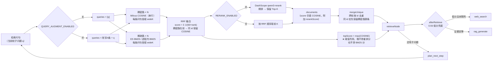

# 检索增强改造文档（b.md 落地）

> ⚠️ **时效说明（2026-09-28）**：01~04 记录的是含 Elasticsearch、src/rag 五文件的阶段版本。
> 检索层随后做了精简重构（删 ES、文件合并为 `src/hybrid.mjs` + rerank 两个文件、新增编号硬过滤、
> 查询扩展内联回 `ragGraph.mjs` 且默认关）。**当前生效架构以 [05-混合检索精简重构与编号硬过滤.md](./05-混合检索精简重构与编号硬过滤.md) 为准**，冲突处以 05 为准。

> 目标：参考 `advanced-rag/src/rag`、`advanced-rag/src/rerank` 两个目录，用**最小的改动**把本项目
> 从「单路向量 Top-5」升级为「宽召回 → 多路 RRF 融合 → 重排 → 生成」，并保证线上可一键回退。

## 结论先行

| 阶段 | 能力 | 状态 | 需要迁移知识库？ | 默认开关 |
|---|---|---|:---:|---|
| Phase 1 | 宽召回 + DashScope 重排（cross-encoder） | **已实现 + 已实测** | 否 | `RERANK_ENABLED=true` |
| Phase 3 | 查询改写 + 多路召回 + RRF 融合 | **已实现 + 已实测** | 否 | `QUERY_AUGMENT_ENABLED=false` |
| Phase 2 | 稀疏路 BM25（**ES 倒排 / 进程内 BM25 双后端**） | **已实现 + 已实测** | 否 | `SPARSE_BACKEND=auto` |

- Phase 1 是本次主要收益来源：**零新增依赖、零数据迁移**，只把初召回从 5 条放宽到 15 条再精排回 5 条。
- Phase 3 提供真正的「多路召回」，但每轮多花 1 次小模型调用 + N 次 embedding，因此在免费档 QPS 下默认关闭。
- Phase 2 最初以为「必须迁移 Milvus 集合（加 BM25 字段 + 稀疏向量）」，后来换了思路：
  **稀疏路根本不需要向量**，只要 `id + 正文 + 章号`，于是改为「ES 建倒排索引 / 进程内 BM25」两条路，
  **零迁移、零 embedding 调用**。详情与实测证据见 [04-混合检索.md](./04-混合检索.md)。

## 改造后的检索链路



Phase 2 新增的是「稀疏路 × N」与 RRF 的第二个输入口；其余节点全部复用原有实现。

## 环境变量速查

| 变量 | 默认 | 作用 | 什么时候改 |
|---|---|---|---|
| `RERANK_URL` | 无 | DashScope 原生 text-rerank 地址 | **必须配，否则重排自动停用** |
| `RERANK_MODEL` | `qwen3-rerank` | 重排模型 | 换模型时 |
| `RERANK_ENABLED` | `true` | 重排总开关 | 线上排查时置 `false` 一键回退 |
| `RERANK_CANDIDATE_K` | `15` | 宽召回候选条数（也是融合后送重排的条数） | **设成 5 = 完全回到改造前行为** |
| `RERANK_TOP_N` | 跟随 `k`(5) | 重排后保留条数 | 想让 LLM 看到更多依据时调大 |
| `QUERY_AUGMENT_ENABLED` | `false` | 查询改写（多路召回） | 演示「多路召回」时置 `true` |
| `AUGMENT_QUERY_COUNT` | `3` | 改写条数（不含原问题） | 想更全→调大，想更快→调小 |
| `SPARSE_BACKEND` | `auto` | 稀疏路后端 `auto/es/memory/none` | **`none` = 关闭稀疏路，回到纯向量** |
| `ES_NODE` | 无 | ES 地址 | 本机配 `http://localhost:9200`；**线上不要配** |
| `ES_INDEX` | `tsxk_starry_sky` | ES 索引名 | 一般不用改 |

## 文件索引

| 文档 | 内容 | 什么时候看 |
|---|---|---|
| [01-参考实现拆解与选型决策.md](./01-参考实现拆解与选型决策.md) | 两个参考目录逐文件拆解、采纳了什么、**否决了什么、为什么** | 面试讲「技术选型」、复盘时 |
| [02-改造点清单.md](./02-改造点清单.md) | 新增/修改的每个文件、每个函数、每条语义边界 | 代码 review、后续继续改 |
| [03-运行验证与迁移手册.md](./03-运行验证与迁移手册.md) | Phase 1/3 的验证步骤与实测数据、回退操作 | 部署上线、复现实验 |
| [04-混合检索.md](./04-混合检索.md) | Phase 2 双通道检索：ES/内存双后端、语料为何重算、`topScore` 与分数尺子守卫、A/B 实测 | 讲「混合检索」、部署 ES、排查召回 |

## 本次交付物一览

**Phase 1 / 3 新增 3 个文件**

```
src/rerank/dashscopeRerank.mjs   # Phase 1：DashScope 文本重排器
src/rag/queryAugment.mjs         # Phase 3：查询改写 + 问句拼接
src/rag/hybridRetrieval.mjs      # 融合层：RRF（Phase 2 稀疏路复用的就是它）
```

**Phase 2（混合检索）新增 6 个文件**

```
src/rag/sparseCorpus.mjs    # 从 EPUB 重算 11977 条稀疏语料（模块级 memo）
src/rag/bm25Index.mjs       # bigram 分词 + 纯 JS BM25 倒排索引（零依赖）
src/rag/sparseRecall.mjs    # 稀疏路统一入口：ES / 内存 双后端 + 自动降级
src/syncEsIndex.mjs         # 建索引 + bulk 灌 11977 条（npm run sync:es）
docker-compose.es.yml       # 本机 ES 复现用（8.17 + analysis-ik）
eval/ab-compare.mjs         # 检索层消融对照：20 题 × 多配置（npm run eval:ab）
```

**修改的文件（都是小改）**

```
src/ragGraph.mjs   # +检索增强配置段；+retrieveWithRerank()；retrieveNode 改 3 处；
                   # +稀疏路接入（denseLists/sparseLists 分开、topScore 只取稠密路、
                   #  mergeUnique/formatSources 加 channel 守卫）
package.json       # +3 个 script：sync:es、eval:ab、eval:ab:answer
.env / .env.example # +检索增强与混合检索配置
```

**新增 npm 依赖**：Phase 1/3 零新增；Phase 2 只加了 `@elastic/elasticsearch`（进程内 BM25 是纯 JS）。

## 实测数据（本地，2026-09-25）

### A. 重排带来的排序纠正（`QUERY_AUGMENT_ENABLED=false`）

问题：`罗峰为什么选择加入极限武馆？`，`k=5`，`maxRetrievalCount=2`，`RERANK_CANDIDATE_K=15`

```
第1轮  候选12条 → 重排保留5条，最高重排分0.9772
       [R1] score=0.7040 rerank=0.9772 第10章   ← COSINE 只排第 4，重排后升到第 1
       [R2] score=0.7321 rerank=0.9670 第30章
       ...
第2轮  候选11条 → 重排保留5条，最高重排分0.9538
最终   documents=10 条，lastTopScore=0.7484（COSINE 量纲，未被重排分污染）
```

**关键观察：重排确实改变了排序** —— 第 10 章的片段 COSINE 分只有 0.7040（在本轮 5 条里排第 4），
但重排分 0.9772 排第 1。这正是「Top-5 按向量分选出来 ≠ 最相关的 5 条」的实证，
也是 README「已知边界」里那条「初始 Top-5 对目标章节的召回仍不稳定」的直接解法。

### B. 多路召回（`QUERY_AUGMENT_ENABLED=true`，改写 3 条）

```
查询改写：新增 3 条问句，走多路召回
  改写1：罗峰在进入极限武馆之前有哪些修炼经历？
  改写2：罗峰加入极限武馆之前都经历了哪些修行过程？
  改写3：在成为极限武馆成员之前，罗峰的修炼历程是怎样的？
重排完成：候选15条 → 保留5条，最高重排分0.9078
最终   lastTopScore=0.7577
```

**这次实测推翻了一个照搬参考实现的做法（预算拆分）**：

| 方案 | 候选数 | 说明 |
|---|---:|---|
| 单路宽召回 15 条 | 12 | 基线 |
| 4 路各 4 条（**参考实现的 `ceil(15/4)` 拆分**） | **6** | 拆完并集反而更小 ❌ |
| 4 路各 15 条（**本项目做法**） | **15** | 修复后 ✅ |

原因是同义改写问句的 Top-N **高度重叠**，拆分预算等于把每路都砍到只剩头部，
并集比单路还小 —— 详见 [01-参考实现拆解与选型决策.md](./01-参考实现拆解与选型决策.md) §五。

**一处待查的观察**：单路宽召回请求 15 条时实际返回 11~12 条，未足额。
怀疑与 `IVF_FLAT` 的默认 `nprobe` 只探测部分簇有关，暂未深挖；不影响效果。